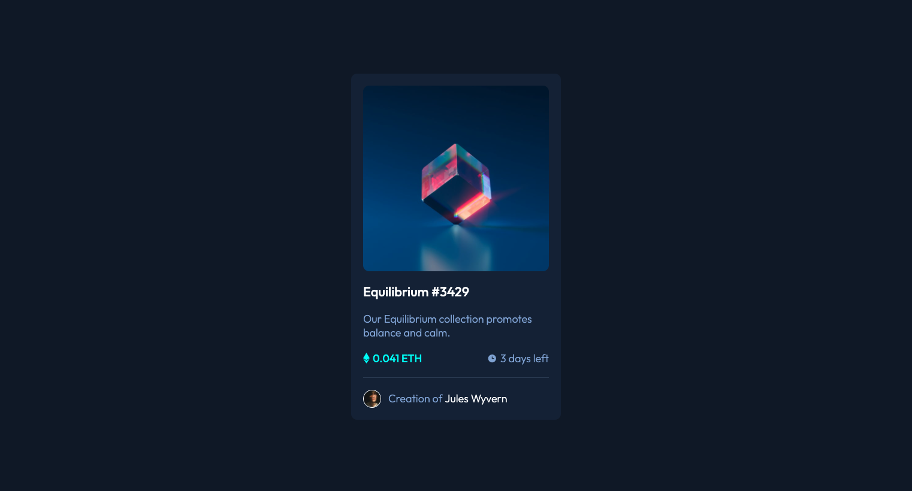

# Frontend Mentor - NFT preview card component solution

This is a solution to the [NFT preview card component challenge on Frontend Mentor](https://www.frontendmentor.io/challenges/nft-preview-card-component-SbdUL_w0U). Frontend Mentor challenges help you improve your coding skills by building realistic projects. 

## Table of contents

- [Overview](#overview)
  - [The challenge](#the-challenge)
  - [Screenshot](#screenshot)
  - [Links](#links)
- [My process](#my-process)
  - [Built with](#built-with)
  - [What I learned](#what-i-learned)
  - [Continued development](#continued-development)
  - [Useful resources](#useful-resources)
- [Author](#author)

## Overview

### The challenge

Users should be able to:

- View the optimal layout depending on their device's screen size
- See hover states for interactive elements

### Screenshot



### Links

- [Solution URL](https://www.frontendmentor.io/solutions/pure-htmlcss-with-flexbox-QILEYQ9mn)
- [Live Site URL](https://skyebrownh.github.io/nft-preview-card/)

## My process

### Built with

- Semantic HTML5 markup
- CSS custom properties
- Flexbox
- Mobile-first workflow

### What I learned

This was my first frontend coding project in a while, so I was able to refresh my memory on things I had forgotten. Particularly:
- CSS Variables
- Responsive Images
- Psuedo Elements
- Display Properties & Positioning

My biggest challenge came with the implementation of the card image hover state. First, I had trouble getting the colored overlay to adhere to the correct dimensions. Then, I realized from the design that the view icon needed to be full opacity on top of the partially transparent overlay.

I was finally able to implement this by using a wrapper element around the card image, adding `::before` and `::after` pseudo elements to hold the two distinct parts of the overlay, and placing my hover state styles on those pseudo elements. 

```css
.card-img-overlay::before {
    content: '';
    position: absolute; /* take overlay out of normal document flow */
    left: 0;
    top: 0;
    width: 100%; /* set to width of the image */
    height: 100%; /* set to height of the image */
    background: var(--cyan-color);
    opacity: 0;
    transition: .5s ease;

.card-img-overlay:hover::before {
    cursor: pointer;
    opacity: 0.5; /* only partially show the colored background */
}

.card-img-overlay::after {
    content: url(./images/icon-view.svg); /* view icon */
    position: absolute;
    top: 50%;
    left: 50%;
    transform: translate(-50%, -50%); /* correct the positioning to account for the width & height of the icon (absolute position offsets are based on the top right corner, not the center) */
    opacity: 0;
}

.card-img-overlay:hover::after {
    cursor: pointer;
    opacity: 1; /* full opacity icon */
    transition: .5s ease;
}
```

### Continued development

This challenge helped me understand that I want to continue to learn & practice complex positioning and transitions/animations. I will look to implement these concepts in future challenges.

### Useful resources

- [CSS Content Property (CSS Tricks)](https://css-tricks.com/almanac/properties/c/content/) - I wasn't sure how to use an image as the `content` value of my pseudo element.
- [Colored Image Overlay (Stack Overflow)](https://stackoverflow.com/questions/46362548/image-hover-color-overlay) - I read many different resources to try to find a good solution for the colored image overlay portion of this challenge. This was the best one I found.
- [Center with Absolute Positioning (Medium)](https://medium.com/front-end-weekly/absolute-centering-in-css-ea3a9d0ad72e) - I knew to use `top: 50%` and `left: 50%` but couldn't remember how to adjust for the size of the element.
- [Display Inline vs Inline-Block (Digital Ocean)](https://www.digitalocean.com/community/tutorials/css-display-inline-vs-inline-block) - Helped me realize that `display: inline` is not useful is most situations since it does not respect basic dimensions & spacing properties.
- [Image Styling (W3Schools)](https://www.w3schools.com/css/css3_images.asp) - A reminder on the best way to style responsive images.
- [CSS Variables (MDN Web Docs)](https://developer.mozilla.org/en-US/docs/Web/CSS/Using_CSS_custom_properties) - Syntax for CSS Variables.

## Author

### Skye Brown
- Frontend Mentor - [@skyebrownh](https://www.frontendmentor.io/profile/skyebrownh)
- Twitter - [@skyebrownh](https://www.twitter.com/skyebrownh)
- GitHub - [@skyebrownh](https://www.github.com/skyebrownh)